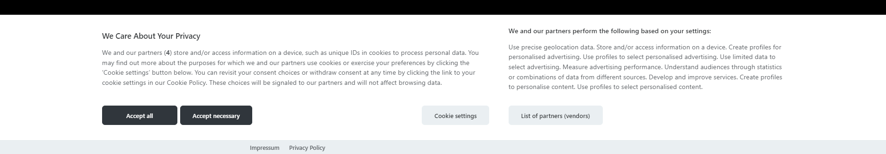

# CookieConsent with TCF compliance

A __lightweight__ & __gdpr compliant__ cookie consent plugin written in plain javascript.

This is a fork that has TCF compliance implemented through new configuration options.



### Original Documentation
Docs available at [cookieconsent.orestbida.com](https://cookieconsent.orestbida.com).

## NextJS Demo
Check out the [Next.js demo application](./demo/nextjs_appdir).

## New configuration options

### CookieConsentConfig
+ `isTcfCompliant?: boolean`
  + Should the consent modal be TCF compliant and use the `tcfComplianceConfig` for more detailed configuration
  + default: `false`
  + *NOTE: By enabling TCF compliance the `disablePageInteraction` config value is set to `true` and consent modal layout is fixed to bar-bottom.*

+ `tcfComplianceConfig?: TcfComplianceConfig`
  + Detailed configuration to use if the `isTcfCompliant` configuration option is set to `true`

### TcfComplianceConfig
+ `disclosedVendorIds?: number[]`
  + Number IDs of disclosed third party vendors you work with.
  + Leaving this undefined or empty will disclose all possible vendors registered in the IAB TCF.
    + https://vendor-list.consensu.org/v3/vendor-list.json
  + *Note: An inappropriately large number of vendors may affect the ability of users to make informed decisions and may increase legal risks for both publishers and vendors.*

### GuiOptions
+ `consentModal?` - by enabling TCF compliance consent modal layout is __fixed__ to `bar-bottom` and these settings are not applied.

+ `vendorsModal?` - configuration object for tweaking the vendors modal UI.
  ```
  vendorsModal?: {
      /**
        * Change vendorsModal layout.
        */
      layout?: VendorsModalLayout

      /**
        * This options is valid only if layout=bar.
        */
      position?: VendorsModalPosition
  }
  ```
    + `VendorsModalLayout` - `"box" | "bar"`
    + `VendorsModalPosition` - `"left" | "right"`

### Translation
+ `vendorsModal?: VendorsModalOptions`
  + Translation information for vendors modal
  + *NOTE: This is only used if the `isTcfCompliant` is set to `true`*

#### ConsentModalOptions
+ `descriptionCountPlaceholder?: string`
  + Specifies what is the vendor count placeholder in the description text that should be replaced with the appropriate count
  + default: `"{{count}}"`
  + *NOTE: This is only used if the `isTcfCompliant` is set to `true`*

+ `vendorTitle?: string`
  + Set the title displayed above the vendors section in the consent modal
  + default: `"We and our partners perform the following based on your settings"`
  + *NOTE: This is only used if the `isTcfCompliant` is set to `true`*

+ `showVendorsBtn?: string`
  + Set the label for a vendors button
  + default: `"List of partners (vendors)"`
  + *NOTE: This is only used if the `isTcfCompliant` is set to `true`*

#### PreferencesModalOptions
+ `purposeVendorCountLabel?: string`
  + Set the label text that will be shown under the purpose title communicating to the user how many vendors can use the specific purpose
  + default: `"{{count}} partners can use this purpose"`
  + *NOTE: This is only used if the `isTcfCompliant` is set to `true`*

+ `purposeVendorCountPlaceholder?: string`
  + Specifies what is the vendor count placeholder in the `purposeVendorCountLabel` that should be replaced with the appropriate count
  + default: `"{{count}}"`
  + *NOTE: This is only used if the `isTcfCompliant` is set to `true`*

+ `viewVendorsLabel?: string`
  + Label for the view vendors list link
  + default: `"List of IAB Vendors"`
  + *NOTE: This is only used if the `isTcfCompliant` is set to `true`*

+ `viewIllustrationsLabel?: string`
  + Label for the view illustrations link
  + default: `"View Illustrations"`
  + *NOTE: This is only used if the `isTcfCompliant` is set to `true`*

+ `illustrationsTitle?: string`
  + Set the illustrations modal title
  + default: `"Illustrations"`
  + *NOTE: This is only used if the `isTcfCompliant` is set to `true`*

#### VendorsModalOptions
+ `title?: string`
  + Set the vendors modal title
  + default: `"IAB Vendors List"`

+ `closeIconLabel?: string`
  + Accessibility label for the close icon

+ `backIconLabel?: string`
  + Accessibility label for the back icon

+ `allowAllConsentBtn?: string`
  + Label for the button allowing all vendor consents
  + default: `"Allow all"`

+ `denyAllConsentBtn?: string`
  + Label for the button denying all vendor consents
  + default: `"Deny all"`

+ `allowSelectionBtn?: string`
  + Label for the button allowing selected vendor consents
  + default: `"Allow current selection"`

+ `viewPrivacyPolicyLabel?: string`
  + Label for the vendor privacy policy link
  + default: `"View Privacy Policy"`

+ `viewLegitimateInterestClaimLabel?: string`
  + Label for the vendor view legitimate interest claim link
  + default: `"View Legitimate Interest Claim"`

+ `viewDeviceStorageDisclosureLabel?: string`
  + Label for the vendor view device storage disclosure link
  + default: `"View Device Storage Disclosure"`

+ `cookieLifespanLabel?: string`
  + Label for the cookie lifespan header in the information list
  + default: `"Cookie Lifespan"`

+ `cookieLifespanMonthsLabel?: string`
  + Translation label for the cookie lifespan information
  + default: `"Months"`

+ `usesNonCookieAccessLabel?: string`
  + Label if the vendor uses other methods of storage in addition to cookies
  + default: `"This vendor utilizes other methods of storage or accessing information in addition to cookies"`

+ `dataDeclarationLabel?: string`
  + Label for the data declaration header in the information list
  + default: `"Data Declaration"`

+ `dataRetentionLabel?: string`
  + Label for the data retention header in the information list
  + default: `"Data Retention"`

+ `standardRetentionLabel?: string`
  + Label for the standard data retention information
  + default: `"Standard Retention"`

+ `dataRetentionDaysLabel?: string`
  + Translation label for the data retention days information
  + default: `"Days"`

+ `consentPurposesLabel?: string`
  + Label for the consent purposes header in the information list
  + default: `"Consent Purposes"`

+ `legitimateInterestPurposesLabel?: string`
  + Label for the legitimate interest purposes header in the information list
  + default: `"Legitimate Interest Purposes"`

+ `specialPurposesLabel?: string`
  + Label for the special purposes header in the information list
  + default: `"Special Purposes"`

+ `featuresLabel?: string`
  + Label for the features header in the information list
  + default: `"Features"`

+ `specialFeaturesLabel?: string`
  + Label for the special features header in the information list
  + default: `"Special Features"`

## New CSS variables
+ `--cc-vendor-border`
+ `--cc-vendor-block-bg`
+ `--cc-vendor-block-border`
+ `--cc-vendor-block-hover-bg`
+ `--cc-vendor-block-hover-border`
+ `--cc-vendor-expanded-block-bg`
+ `--cc-vendor-expanded-block-hover-bg`

These values are initially the same as their `cookie-category` counterparts.
  + e.g. `--cc-vendor-block-bg` has the same value as `--cc-cookie-category-block-bg`

## New API functions
+ `onChange?` - callback fired when categories, services or TCF data has changed.

  ```
  onChange?: (param: {
      cookie: CookieValue
      changedCategories: string[],
      changedServices: {[key: string]: string[]},
      changedPurposeIds?: number[],
      changedSpecialFeatureIds?: number[],
      changedVendorIds?: number[]
  }) => void
  ```

+ `showVendors(): void` - shows the vendors modal
+ `hideVendors(): void` - hides the vendors modal

+ `acceptMultiple` - accept / reject multiple consent values
  ```
  /**
    * Accept/Reject multiple.
    *
    * @param categories Categories to accept
    * @param excludedCategories Categories to exclude
    * @param purposesToAccept Purposes to accept
    * @param specialFeaturesToAccept Special features to accept
    * @param vendorsToAllow Vendors to allow
    */
  function acceptMultiple(categories: string | string[], excludedCategories?: string[], purposesToAccept?: 'all' | number[], specialFeaturesToAccept?: 'all' | number[], vendorsToAllow?: 'all' | number[]): void
  ```

+ `allowVendors` - allow / deny vendors
  ```
  /**
    * Allow / Deny vendors.
    *
    * @param vendorsToAllow Vendors to allow or an 'all' keyword to allow all disclosed
    */
  function allowVendors(vendorsToAllow: 'all' | number[]): void;
  ```

+ `acceptedPurpose` - returns `true` if purpose is accepted, otherwise `false`
  ```
  /**
    * Returns true if purpose is accepted, otherwise false.
    *
    * @param purposeId Identifier of the purpose
    * @returns True if the purpose is accepted
    */
  function acceptedPurpose(purposeId: number): boolean
  ```

+ `acceptedSpecialFeature` - returns `true` if special feature is accepted, otherwise `false`
  ```
  /**
    * Returns true if special feature is accepted, otherwise false.
    *
    * @param specialFeatureId Identifier of the special feature
    * @returns True if the special feature is accepted
    */
  function acceptedSpecialFeature(specialFeatureId: number): boolean
  ```

+ `allowedVendor` - returns `true` if vendor is allowed, otherwise `false`
  ```
  /**
    * Returns true if vendor is allowed, otherwise false.
    *
    * @param vendorId Identifier of the vendor
    * @returns True if the vendor if allowed
    */
  function allowedVendor(vendorId: number): boolean
  ```

## New custom attribute values
+ `show-vendorsModal` - use this value to show the vendors modal

## Updated interfaces

### CookieValue
+ `purposeIds: number[]` - accepted purpose IDs
+ `specialFeatureIds: number[]` - accepted special feature IDs
+ `vendorIds: number[]` - allowed vendor IDs

## License
Distributed under the MIT License. See [LICENSE](https://github.com/Enterwell/cookieconsent/blob/master/LICENSE) for more information.