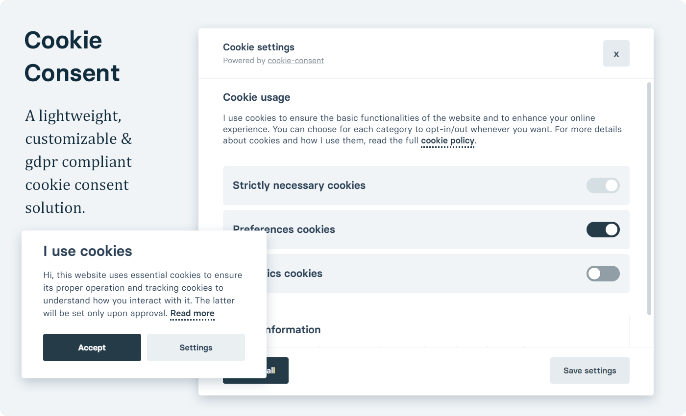
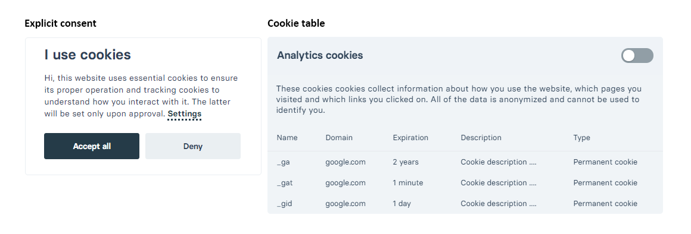

<h1 align="center" style="text-align: center;">Cookie Consent</h1>
<div align="center" style="text-align: center;">

[](https://opensource.org/licenses/MIT)

[](https://github.com/orestbida/cookieconsent/releases)
</div>
<div align="center" style="text-align: center; max-width: 770px; margin: 0 auto;">

A __lightweight__ & __gdpr compliant__ cookie consent plugin written in plain javascript.

</div>
<div style="padding-top: .6em;">



</div>

## Table of contents
- [Table of contents](#table-of-contents)
- [Key features](#key-features)
- [Installation & Usage](#installation--usage)
- [Layout options & customization](#layout-options--customization)
- [How to block/manage scripts](#how-to-blockmanage-scripts)
- [API methods](#api-methods)
- [Available `data-cc` actions](#available-data-cc-actions)
- [Available callbacks](#available-callbacks)
  - [All configuration options](#all-configuration-options)
- [Full example configurations](#full-example-configurations)
  - [How to configure languages & cookie settings](#how-to-configure-languages--cookie-settings)
- [How to enable/manage revisions](#how-to-enablemanage-revisions)
- [FAQ](#faq)
- [License](#license)

## Key features
- __Lightweight__
- __Cross-browser__ support (IE10+ [*](#note-css-variables-are-not-supported-on-ie))
- __Standalone__ (no external dependencies needed)
- __GDPR compliant__
- __Support for multi language__
- __[WAI-ARIA](https://developer.mozilla.org/en-US/docs/Learn/Accessibility/WAI-ARIA_basics) compliant__
- Allows you to __define different cookie categories with opt in/out toggle__
- Allows you to __define custom cookie tables__ to specify the cookies you use

## Installation & Usage
1. Download the [latest release](https://github.com/orestbida/cookieconsent/releases/latest) or use via CDN or [NPM](https://www.npmjs.com/package/vanilla-cookieconsent)

    ```bash
    # CDN links
    https://cdn.jsdelivr.net/gh/orestbida/cookieconsent@v2.8.9/dist/cookieconsent.js
    https://cdn.jsdelivr.net/gh/orestbida/cookieconsent@v2.8.9/dist/cookieconsent.css
    ```

    Thanks to [Till Sanders](https://github.com/tillsanders) for bringing the plugin on npm.

    ```bash
    npm i vanilla-cookieconsent
    yarn add vanilla-cookieconsent
    ```

1. Import the plugin: add a `script` tag pointing to `cookieconsent.js`
    ```html
    <html>
        <head>
            <!-- head content -->
            <!-- Deferred CSS loading (recommended) -->
            <link rel="stylesheet" href="<path-to-cookieconsent.css>" media="print" onload="this.media='all'">
        </head>
        <body>
            <!-- body content -->
            <script defer src="<path-to-cookieconsent.js>"></script>
        </body>
    </html>
    ```
    <span>Note: replace `<path-to-cookieconsent.js>` and `<path-to-cookieconsent.css>` with valid paths!</span>
    <br>

3. Configure and run
    -   <details><summary>As external script</summary>
        <p>

        - Create a `.js` file (e.g. `cookieconsent-init.js`) and import it in your html page

            ```html
            <body>
                <!-- body content ... -->
                <script defer src="<path-to-cookieconsent.js>"></script>
                <script defer src="<path-to-cookieconsent-init.js>"></script>
            <body>
            ```

        - Configure the plugin inside `cookieconsent-init.js`

            ```javascript
            // obtain plugin
            var cc = initCookieConsent();

            // run plugin with your configuration
            cc.run({
                current_lang: 'en',
                autoclear_cookies: true,                   // default: false
                page_scripts: true,                        // default: false

                // mode: 'opt-in'                          // default: 'opt-in'; value: 'opt-in' or 'opt-out'
                // delay: 0,                               // default: 0
                // auto_language: null                     // default: null; could also be 'browser' or 'document'
                // autorun: true,                          // default: true
                // force_consent: false,                   // default: false
                // hide_from_bots: false,                  // default: false
                // remove_cookie_tables: false             // default: false
                // cookie_name: 'cc_cookie',               // default: 'cc_cookie'
                // cookie_expiration: 182,                 // default: 182 (days)
                // cookie_necessary_only_expiration: 182   // default: disabled
                // cookie_domain: location.hostname,       // default: current domain
                // cookie_path: '/',                       // default: root
                // cookie_same_site: 'Lax',                // default: 'Lax'
                // use_rfc_cookie: false,                  // default: false
                // revision: 0,                            // default: 0

                onFirstAction: function(user_preferences, cookie){
                    // callback triggered only once
                },

                onAccept: function (cookie) {
                    // ...
                },

                onChange: function (cookie, changed_preferences) {
                    // ...
                },

                languages: {
                    'en': {
                        consent_modal: {
                            title: 'We use cookies!',
                            description: 'Hi, this website uses essential cookies to ensure its proper operation and tracking cookies to understand how you interact with it. The latter will be set only after consent. <button type="button" data-cc="c-settings" class="cc-link">Let me choose</button>',
                            primary_btn: {
                                text: 'Accept all',
                                role: 'accept_all'              // 'accept_selected' or 'accept_all'
                            },
                            secondary_btn: {
                                text: 'Reject all',
                                role: 'accept_necessary'        // 'settings' or 'accept_necessary'
                            }
                        },
                        settings_modal: {
                            title: 'Cookie preferences',
                            save_settings_btn: 'Save settings',
                            accept_all_btn: 'Accept all',
                            reject_all_btn: 'Reject all',
                            close_btn_label: 'Close',
                            cookie_table_headers: [
                                {col1: 'Name'},
                                {col2: 'Domain'},
                                {col3: 'Expiration'},
                                {col4: 'Description'}
                            ],
                            blocks: [
                                {
                                    title: 'Cookie usage 📢',
                                    description: 'I use cookies to ensure the basic functionalities of the website and to enhance your online experience. You can choose for each category to opt-in/out whenever you want. For more details relative to cookies and other sensitive data, please read the full <a href="#" class="cc-link">privacy policy</a>.'
                                }, {
                                    title: 'Strictly necessary cookies',
                                    description: 'These cookies are essential for the proper functioning of my website. Without these cookies, the website would not work properly',
                                    toggle: {
                                        value: 'necessary',
                                        enabled: true,
                                        readonly: true          // cookie categories with readonly=true are all treated as "necessary cookies"
                                    }
                                }, {
                                    title: 'Performance and Analytics cookies',
                                    description: 'These cookies allow the website to remember the choices you have made in the past',
                                    toggle: {
                                        value: 'analytics',     // your cookie category
                                        enabled: false,
                                        readonly: false
                                    },
                                    cookie_table: [             // list of all expected cookies
                                        {
                                            col1: '^_ga',       // match all cookies starting with "_ga"
                                            col2: 'google.com',
                                            col3: '2 years',
                                            col4: 'description ...',
                                            is_regex: true
                                        },
                                        {
                                            col1: '_gid',
                                            col2: 'google.com',
                                            col3: '1 day',
                                            col4: 'description ...',
                                        }
                                    ]
                                }, {
                                    title: 'Advertisement and Targeting cookies',
                                    description: 'These cookies collect information about how you use the website, which pages you visited and which links you clicked on. All of the data is anonymized and cannot be used to identify you',
                                    toggle: {
                                        value: 'targeting',
                                        enabled: false,
                                        readonly: false
                                    }
                                }, {
                                    title: 'More information',
                                    description: 'For any queries in relation to our policy on cookies and your choices, please <a class="cc-link" href="#yourcontactpage">contact us</a>.',
                                }
                            ]
                        }
                    }
                }
            });
            ```
        </p>
        </details>
    -   <details><summary>As inline script</summary>
        <p>

        ```html
        <body>
            <!-- body content ... -->
            <script defer src="<path-to-cookieconsent.js>"></script>

            <!-- Inline script -->
            <script>
                window.addEventListener('load', function(){

                    // obtain plugin
                    var cc = initCookieConsent();

                    // run plugin with your configuration
                    cc.run({
                        current_lang: 'en',
                        autoclear_cookies: true,                   // default: false
                        page_scripts: true,                        // default: false

                        // mode: 'opt-in'                          // default: 'opt-in'; value: 'opt-in' or 'opt-out'
                        // delay: 0,                               // default: 0
                        // auto_language: '',                      // default: null; could also be 'browser' or 'document'
                        // autorun: true,                          // default: true
                        // force_consent: false,                   // default: false
                        // hide_from_bots: false,                  // default: false
                        // remove_cookie_tables: false             // default: false
                        // cookie_name: 'cc_cookie',               // default: 'cc_cookie'
                        // cookie_expiration: 182,                 // default: 182 (days)
                        // cookie_necessary_only_expiration: 182   // default: disabled
                        // cookie_domain: location.hostname,       // default: current domain
                        // cookie_path: '/',                       // default: root
                        // cookie_same_site: 'Lax',                // default: 'Lax'
                        // use_rfc_cookie: false,                  // default: false
                        // revision: 0,                            // default: 0

                        onFirstAction: function(user_preferences, cookie){
                            // callback triggered only once on the first accept/reject action
                        },

                        onAccept: function (cookie) {
                            // callback triggered on the first accept/reject action, and after each page load
                        },

                        onChange: function (cookie, changed_categories) {
                            // callback triggered when user changes preferences after consent has already been given
                        },

                        languages: {
                            'en': {
                                consent_modal: {
                                    title: 'We use cookies!',
                                    description: 'Hi, this website uses essential cookies to ensure its proper operation and tracking cookies to understand how you interact with it. The latter will be set only after consent. <button type="button" data-cc="c-settings" class="cc-link">Let me choose</button>',
                                    primary_btn: {
                                        text: 'Accept all',
                                        role: 'accept_all'              // 'accept_selected' or 'accept_all'
                                    },
                                    secondary_btn: {
                                        text: 'Reject all',
                                        role: 'accept_necessary'        // 'settings' or 'accept_necessary'
                                    }
                                },
                                settings_modal: {
                                    title: 'Cookie preferences',
                                    save_settings_btn: 'Save settings',
                                    accept_all_btn: 'Accept all',
                                    reject_all_btn: 'Reject all',
                                    close_btn_label: 'Close',
                                    cookie_table_headers: [
                                        {col1: 'Name'},
                                        {col2: 'Domain'},
                                        {col3: 'Expiration'},
                                        {col4: 'Description'}
                                    ],
                                    blocks: [
                                        {
                                            title: 'Cookie usage 📢',
                                            description: 'I use cookies to ensure the basic functionalities of the website and to enhance your online experience. You can choose for each category to opt-in/out whenever you want. For more details relative to cookies and other sensitive data, please read the full <a href="#" class="cc-link">privacy policy</a>.'
                                        }, {
                                            title: 'Strictly necessary cookies',
                                            description: 'These cookies are essential for the proper functioning of my website. Without these cookies, the website would not work properly',
                                            toggle: {
                                                value: 'necessary',
                                                enabled: true,
                                                readonly: true          // cookie categories with readonly=true are all treated as "necessary cookies"
                                            }
                                        }, {
                                            title: 'Performance and Analytics cookies',
                                            description: 'These cookies allow the website to remember the choices you have made in the past',
                                            toggle: {
                                                value: 'analytics',     // your cookie category
                                                enabled: false,
                                                readonly: false
                                            },
                                            cookie_table: [             // list of all expected cookies
                                                {
                                                    col1: '^_ga',       // match all cookies starting with "_ga"
                                                    col2: 'google.com',
                                                    col3: '2 years',
                                                    col4: 'description ...',
                                                    is_regex: true
                                                },
                                                {
                                                    col1: '_gid',
                                                    col2: 'google.com',
                                                    col3: '1 day',
                                                    col4: 'description ...',
                                                }
                                            ]
                                        }, {
                                            title: 'Advertisement and Targeting cookies',
                                            description: 'These cookies collect information about how you use the website, which pages you visited and which links you clicked on. All of the data is anonymized and cannot be used to identify you',
                                            toggle: {
                                                value: 'targeting',
                                                enabled: false,
                                                readonly: false
                                            }
                                        }, {
                                            title: 'More information',
                                            description: 'For any queries in relation to our policy on cookies and your choices, please <a class="cc-link" href="#yourcontactpage">contact us</a>.',
                                        }
                                    ]
                                }
                            }
                        }
                    });
                });
            </script>
        <body>
        ```
      </p>
    </details>
    <br>

## Layout options & customization
You can change the color scheme with css variables inside cookieconsent.css. You can also change some basic layout options via the `gui_options` inside the config. object; example:

```javascript
cookieconsent.run({
    // ...
    gui_options: {
        consent_modal: {
            layout: 'cloud',               // box/cloud/bar
            position: 'bottom center',     // bottom/middle/top + left/right/center
            transition: 'slide',           // zoom/slide
            swap_buttons: false            // enable to invert buttons
        },
        settings_modal: {
            layout: 'box',                 // box/bar
            // position: 'left',           // left/right
            transition: 'slide'            // zoom/slide
        }
    }
    //...
});
```
<i>Default layout is `box` and default transition is `zoom`.</i>

You can alter the color scheme by overriding the available css variables which you can find [here](src/cookieconsent.css).

### Note: css variables are not supported on IE

How to build an ad-hoc stylesheet with your color scheme:

0. make sure you have [nodejs](https://nodejs.org/en/download/) installed
1. download/clone this repo.
2. run `npm install`
3. modify `src/cookieconsent.css` (css variables that will apply to IE are under the `:root` css selector)
4. run `npm run build`
5. use the newly generated `dist/cookieconsent.css` stylesheet

Alternatively, you could load a css variables polyfill.

<br>

## How to block/manage scripts
You can manage any script (inline or external) via the `page_scripts` option:

1. Enable page scripts management:

    ```javascript
    cookieconsent.run({
        // ...
        page_scripts: true
        // ...
    });
    ```
2. Set `type="text/plain"` and `data-cookiecategory="<category>"` to any `script` tag you want to manage:

    ```html
    <script type="text/plain" data-cookiecategory="analytics" src="analytics.js" defer></script>

    <script type="text/plain" data-cookiecategory="ads">
        console.log('"ads" category accepted');
    </script>
    ```
    <i>Note: `data-cookiecategory` must be a valid category defined inside the configuration object</i>


## API methods
After getting the plugin like so:

```javascript
var cookieconsent = initCookieConsent();
```

the following methods are available:

- cookieconsent`.run(<config_object>)`
- cookieconsent`.show(<optional_delay>, <create_modal>)`
- cookieconsent`.hide()`
- cookieconsent`.showSettings(<optional_delay>)`
- cookieconsent`.hideSettings()`

Additional methods for an easier management of your scripts and cookie settings (expand them to see usage example):
- <details><summary>cookieconsent<code>.accept(&lt;accepted_categories&gt;, &lt;optional_rejected_categories&gt;)</code> [v2.5.0+]</summary>
    <p>

    - accepted_categories: `string` or `string[]`
    - rejected_categories: `string[]` - optional

    <br>

    Note: **all categories marked as `readonly` will ALWAYS be enabled/accepted regardless of the categories provided inside the `.accept()` API call.**

    Examples:

    ```javascript
    cookieconsent.accept('all');                // accept all categories
    cookieconsent.accept([]);                   // accept none (reject all)
    cookieconsent.accept('analytics');          // accept only analytics category
    cookieconsent.accept(['cat_1', 'cat_2']);   // accept only these 2 categories
    cookieconsent.accept();                     // accept all currently selected categories inside modal

    cookieconsent.accept('all', ['analytics']); // accept all except "analytics" category
    cookieconsent.accept('all', ['cat_1', 'cat_2']); // accept all except these 2 categories
    ```

    How to later reject a specific category (cookieconsent already accepted)? Same as above:

    ```javascript
    cookieconsent.accept('all', ['targeting']);     // opt out of targeting category
    ```
    </p>
    </details>
- <details><summary>cookieconsent<code>.allowedCategory(&lt;category_name&gt;)</code></summary>
    <p>

    <b>Note:</b> there are no default cookie categories, you create them!


    A cookie category corresponds to the string of the <code>value</code> property inside the <code>toggle</code> object:

    ```javascript
    // ...
    toggle: {
        value: 'analytics',     // cookie category
        enabled: false,         // default status
        readonly: false         // allow to enable/disable
        // reload: 'on_disable',   // allows to reload page when the current cookie category is deselected
    }
    // ...
    ```

    Example:
    ```javascript
    // Check if user accepts cookie consent with analytics category enabled
    if (cookieconsent.allowedCategory('analytics')) {
        // yoo, you might want to load analytics.js ...
    };
    ```
    </p>
    </details>
- <details><summary>cookieconsent<code>.validCookie(&lt;cookie_name&gt;)</code></summary>
    <p>

    If cookie exists and has non empty (<code>''</code>) value => return <code>true</code>, otherwise <code>false</code>.

    ```javascript
    // Example: check if '_gid' cookie is set
    if (!cookieconsent.validCookie('_gid')) {
        // yoo, _gid cookie is not set, do something ...
    };
    ```
    </p>
    </details>
- <details><summary>cookieconsent<code>.eraseCookies(&lt;cookie_names&gt;, &lt;optional_path&gt;, &lt;optional_domains&gt;)</code> [v2.5.0+]</summary>
    <p>

    - cookie_names: `string[]`
    - path: `string` - optional
    - domains: `string[]` - optional

    <br>

    Examples:

    ```javascript
    cookieconsent.eraseCookies(['cc_cookies']);             // erase "cc_cookie" if it exists
    cookieconsent.eraseCookies(['cookie1', 'cookie2']);     // erase these 2 cookies

    cookieconsent.eraseCookies(['cc_cookie'], "/demo");
    cookieconsent.eraseCookies(['cc_cookie'], "/demo", [location.hostname]);
    ```
    </p>
    </details>
- <details><summary>cookieconsent<code>.loadScript(&lt;path&gt;, &lt;callback_function&gt;, &lt;optional_custom_attributes&gt;)</code></summary>
    <p>

    Basic example:

    ```javascript
    cookieconsent.loadScript('https://www.google-analytics.com/analytics.js', function(){
        // Script loaded, do something
    });
    ```
    How to load scripts with custom attributes:
    ```javascript
    cookieconsent.loadScript('https://www.google-analytics.com/analytics.js', function(){
        // Script loaded, do something
    }, [
        {name: 'id', value: 'ga_id'},
        {name: 'another-attribute', value: 'value'}
    ]);
    ```
    </p>
    </details>
- <details><summary>cookieconsent<code>.set(&lt;field&gt;, &lt;object&gt;)</code> [v2.6.0+]</summary>
    <p>

    The `.set()` method allows you to set the following values:
    - **data** (used to save custom data inside the plugin's cookie)
    - **revision**

    <br>

    How to save custom `data`:
    ```javascript
    // Set cookie's "data" field to whatever the value of the `value` prop. is
    cookieconsent.set('data', {value: {id: 21, country: "italy"}});

    // Only add/update the specified props.
    cookieconsent.set('data', {value: {id: 22, new_prop: 'new prop value'}, mode: 'update'});
    ```
    </p>
    </details>
- <details><summary>cookieconsent<code>.get(&lt;field&gt;)</code> [v2.6.0+]</summary>
    <p>

    The `.get()` method allows you to retrieve any of the fields inside the plugin's cookie:
    ```javascript
    cookieconsent.get('level');     // retrieve all accepted categories (if cookie exists)
    cookieconsent.get('data');      // retrieve custom data (if cookie exists)
    cookieconsent.get('revision');  // retrieve revision number (if cookie exists)
    ```
    </p>
    </details>
- <details><summary>cookieconsent<code>.getConfig(&lt;field&gt;)</code> [v2.7.0+]</summary>
    <p>

    The `.getConfig()` method allows you to read configuration options from the current instance:
    ```javascript
    cookieconsent.getConfig('current_lang');        // get currently used language
    cookieconsent.getConfig('cookie_expiration');   // get configured cookie expiration
    // ...
    ```
    </p>
    </details>
- <details><summary>cookieconsent<code>.getUserPreferences()</code> [v2.7.0+]</summary>
    <p>

    The `.getUserPreferences()` returns the following object (for analytics/logging purposes):
    ```javascript
    {
        accept_type: string,            // 'all', 'necessary', 'custom'
        accepted_categories: string[],  // e.g. ['necessary', 'analytics']
        rejected_categories: string[]   // e.g. ['ads']
    }
    ```
    </p>
    </details>
- <details><summary>cookieconsent<code>.updateScripts()</code> [v2.7.0+]</summary>
    <p>

    This method allows the plugin to manage dynamically added/injected scripts that have been loaded after the plugin's execution.

    E.g. dynamic content generated by server side languages like php, node, ruby ...
    </p>
    </details>
- <details><summary>cookieconsent<code>.updateLanguage(&lt;language&gt;, &lt;force_update&gt;)</code> [v2.8.0+]</summary>
    <p>

    Use this method to change modal's language dynamically (without page reload).

    - language: `string`
    - force_update: `boolean` - optional

    <br>

    Example:
    ```javascript
    cookieconsent.updateLanguage('it');
    ```

    Note: language will change only if it is valid (already defined) and different from the current language!

    <br>

    You can also forcefully update the modals (useful if you dynamically change the content of the modals). Example:
    ```javascript
    // Change content: e.g. modify modal title
    cookieconsent.getConfig('languages').en.consent_modal.title = 'New title';

    // Update changes
    cookieconsent.updateLanguage('en', true);
    ```

    </p>
    </details>

<br>

## Available `data-cc` actions
Any button (or link) can use the custom `data-cc` attribute to perform a few actions without manually invoking the api methods.

Valid values:
- `c-settings`: show settings modal
- `accept-all`: accept all categories
- `accept-necessary`: accept only categories marked as necessary/readonly (reject all)
- `accept-custom`: accept currently selected categories inside the settings modal

Examples:
```html
<button type="button" data-cc="c-settings">Show cookie settings</button>
<button type="button" data-cc="accept-all">Accept all cookies</button>
```
<br>

## Available callbacks
The following functions have to be defined inside the configuration object passed to the `.run()` method.

- <details><summary><code>onAccept</code></summary>
    <p>

    This function will be executed:
    - at the first moment that consent is given (just like `onFirstAction`)
    - after every page load, if consent (accept or "reject" action) has already been given

    <br>

    parameters:
    - `cookie`: contains the current value of the cookie

    <br>

    example:
    ```javascript
    //...
    cc.run({
        // ...
        onAccept: function(cookie){
            // load somescript, google analytics ...
        },
        // ...
    });
    ```
    </p>
    </details>
- <details><summary><code>onChange</code></summary>
    <p>

    This function will be executed (only if consent has already been given):
    - when user changes his preferences (accepts/rejects a cookie category)

    <br>

    parameters:
    - `cookie`: contains the current value of the cookie
    - `changed_categories`: array of categories whose state (accepted/rejected) just changed

    <br>

    example:
    ```javascript
    //...
    cc.run({
        // ...
        onChange: function(cookie, changed_categories){
            // cleanup logic ... (e.g. disable gtm if analytics category is disabled)
        },
        // ...
    });
    ```
    </p>
    </details>
- <details><summary><code>onFirstAction</code> [v2.7.0+]</summary>
    <p>

    This function will be executed only once, when the user takes the first action (accept/reject).

    parameters:
    - `user_preferences`: contains the same data provided by the `.getUserPreferences()` API
    - `cookie`: contains the current value of the cookie

    <br>

    example:
    ```javascript
    //...
    cc.run({
        // ...
        onFirstAction: function(user_preferences, cookie){
            console.log('User accept type:', user_preferences.accept_type);
            console.log('User accepted these categories', user_preferences.accepted_categories)
            console.log('User reject these categories:', user_preferences.rejected_categories);
        },
        // ...
    });
    ```
    </p>
    </details>

<br>

### All configuration options

Below a table which sums up all of the available options (must be passed to the .run() method).
| Option              	| Type     	| Default 	| Description                                                                                                                       |
|---------------------	|----------	|---------	|---------------------------------------------------------------------------------------------------------------------------------- |
| `autorun`           	| boolean  	| true    	| If enabled, show the cookie consent as soon as possible (otherwise you need to manually call the `.show()` method)                |
| `delay`             	| number   	| 0       	| Number of `milliseconds` before showing the consent-modal                                                                         |
| `mode`             	| string   	| 'opt-in'  |Accepted values: <br> - `opt-in`: scripts will not run unless consent is given (gdpr compliant) <br> - `opt-out`: scripts — that have categories set as `enabled` by default — will run without consent, until an explicit choice is made                                                 |
| `cookie_expiration` 	| number   	| 182     	| Number of days before the cookie expires (182 days = 6 months)                                                                    |
| `cookie_necessary_only_expiration` 	| number   	| -     	| Specify if you want to set a different number of days - before the cookie expires - when the user accepts only the necessary categories                                                |
| `cookie_path` 	    | string   	| "/"     	| Path where the cookie will be set                                                                                                 |
| `cookie_domain` 	    | string   	| location.hostname | Specify your domain (will be grabbed by default) or a subdomain                                                           |
| `cookie_same_site` 	| string   	| "Lax"     | SameSite attribute                                                           |
| `use_rfc_cookie` 	    | boolean   | false     | Enable if you want the value of the cookie to be rfc compliant                                            |
| `force_consent`       | boolean   | false     | Enable if you want to block page navigation until user action (check [faq](#faq) for a proper implementation) |
| `revision`            | number  	| 0   	    | Specify this option to enable revisions. [Check below](#how-to-enablemanage-revisions) for a proper usage |
| `current_lang`      	| string   	| -       	| Specify one of the languages you have defined (can also be dynamic): `'en'`, `'de'` ...                                           |
| `auto_language`     	| string  	| null  	| Language auto-detection strategy. Null to disable (default), `"browser"` to get user's browser language or `"document"` to read value from `<html lang="...">` of current page. If language is not defined => use specified `current_lang` |
| `autoclear_cookies` 	| boolean  	| false   	| Enable if you want to automatically delete cookies when user opts-out of a specific category inside cookie settings               |
| `page_scripts` 	    | boolean  	| false   	| Enable if you want to easily `manage existing <script>` tags. Check [manage third party scripts](#manage-third-party-scripts)     |
| `remove_cookie_tables`| boolean  	| false   	| Enable if you want to remove the html cookie tables (but still want to make use of `autoclear_cookies`)                           |
| `hide_from_bots`      | boolean  	| false   	| Enable if you don't want the plugin to run when a bot/crawler/webdriver is detected       |
| `gui_options`         | object  	| -   	    | Customization option which allows to choose layout, position	and transition. Check [layout options & customization](#layout-options--customization) |
| __`onAccept`__      	| function 	| -       	| Method run on: <br>  1. the moment the cookie consent is accepted <br> 2. after each page load (if cookie consent has already been accepted) |
| __`onChange`__      	| function 	| -       	| Method run `whenever preferences are modified` (and only if cookie consent has already been accepted)                             |
| __`onFirstAction`__   | function 	| -       	| Method run only `once` when the user makes the initial choice (accept/reject)                                                     |
| `languages`      	    | object 	| -       	| [Check below](#how-to-configure-languages--cookie-settings) for configuration

## Full example configurations
-   <details><summary>Configuration with gtag.js - Google Analytics</summary>
    <p>

    1. enable `page_scripts`
    2. set `type="text/plain"` and `data-cookiecategory="<your-category>"` to each script:

    <br>

    ```html
    <!-- Global site tag (gtag.js) - Google Analytics -->
    <script type="text/plain" data-cookiecategory="analytics" async src="https://www.googletagmanager.com/gtag/js?id=GA_MEASUREMENT_ID"></script>
    <script type="text/plain" data-cookiecategory="analytics">
        window.dataLayer = window.dataLayer || [];
        function gtag(){window.dataLayer.push(arguments);}
        gtag('js', new Date());

        gtag('config', 'GA_MEASUREMENT_ID');
    </script>

    <script defer src="<path-to-cookieconsent.js>"></script>
    <script>
        window.addEventListener('load', function () {
            // obtain cookieconsent plugin
            var cookieconsent = initCookieConsent();

            // run plugin with config object
            cookieconsent.run({
                autorun: true,
                current_lang: 'en',
                autoclear_cookies: true,
                page_scripts: true,

                onFirstAction: function(user_preferences, cookie){
                    // callback triggered only once
                },

                onAccept: function (cookie) {
                    // ... cookieconsent accepted
                },

                onChange: function (cookie, changed_preferences) {
                    // ... cookieconsent preferences were changed
                },

                languages: {
                    en: {
                        consent_modal: {
                            title: 'I use cookies',
                            description: 'Hi, this website uses essential cookies to ensure its proper operation and tracking cookies to understand how you interact with it. The latter will be set only upon approval. <a aria-label="Cookie policy" class="cc-link" href="#">Read more</a>',
                            primary_btn: {
                                text: 'Accept',
                                role: 'accept_all'              // 'accept_selected' or 'accept_all'
                            },
                            secondary_btn: {
                                text: 'Settings',
                                role: 'settings'                // 'settings' or 'accept_necessary'
                            }
                        },
                        settings_modal: {
                            title: 'Cookie preferences',
                            save_settings_btn: 'Save settings',
                            accept_all_btn: 'Accept all',
                            reject_all_btn: 'Reject all',       // optional, [v.2.5.0 +]
                            cookie_table_headers: [
                                {col1: 'Name'},
                                {col2: 'Domain'},
                                {col3: 'Expiration'},
                                {col4: 'Description'},
                                {col5: 'Type'}
                            ],
                            blocks: [
                                {
                                    title: 'Cookie usage',
                                    description: 'I use cookies to ensure the basic functionalities of the website and to enhance your online experience. You can choose for each category to opt-in/out whenever you want.'
                                }, {
                                    title: 'Strictly necessary cookies',
                                    description: 'These cookies are essential for the proper functioning of my website. Without these cookies, the website would not work properly.',
                                    toggle: {
                                        value: 'necessary',
                                        enabled: true,
                                        readonly: true
                                    }
                                }, {
                                    title: 'Analytics cookies',
                                    description: 'These cookies collect information about how you use the website, which pages you visited and which links you clicked on. All of the data is anonymized and cannot be used to identify you.',
                                    toggle: {
                                        value: 'analytics',
                                        enabled: false,
                                        readonly: false
                                    },
                                    cookie_table: [
                                        {
                                            col1: '^_ga',
                                            col2: 'google.com',
                                            col3: '2 years',
                                            col4: 'description ...',
                                            col5: 'Permanent cookie',
                                            is_regex: true
                                        },
                                        {
                                            col1: '_gid',
                                            col2: 'google.com',
                                            col3: '1 day',
                                            col4: 'description ...',
                                            col5: 'Permanent cookie'
                                        }
                                    ]
                                }, {
                                    title: 'More information',
                                    description: 'For any queries in relation to my policy on cookies and your choices, please <a class="cc-link" href="#yourwebsite">contact me</a>.',
                                }
                            ]
                        }
                    }
                }
            });
        });
    </script>
    ```

    </p>
    </details>

### How to configure languages & cookie settings
Languages is an object which basically holds all of the text/html of your cookie modals in different languages. In here you can define `cookie categories`, `cookie tables`, `opt-in/out toggle` for each category and more. For each language, a `consent_modal` object and a `settings_modal` object must be configured.

<details><summary>Example with <b>multiple languages</b> ('en' and 'it')</summary>
<p>

```javascript
cookieconsent.run({
    // ...,
    languages: {
        'en': {
            consent_modal: {
                title: 'Title here ...',
                description: 'Description here ...',
                primary_btn: {
                    text: 'Accept',
                    role: 'accept_all'      // 'accept_selected' or 'accept_all'
                },
                secondary_btn: {
                    text: 'Settings',
                    role: 'settings'        // 'settings' or 'accept_necessary'
                }
            },
            settings_modal: {
                title: 'Cookie preferences ...',
                save_settings_btn: 'Save settings',
                accept_all_btn: 'Accept all',
                blocks: [
                    {
                        title: 'First block title ...',
                        description: 'First block description ...'
                    }, {
                        title: 'Second block title ...',
                        description: 'Second block description ...',
                        toggle: {
                            value: 'my_category1',
                            enabled: true,
                            readonly: true
                        }
                    }, {
                        title: 'Third block title ...',
                        description: 'Third block description ...',
                        toggle: {
                            value: 'my_category2',
                            enabled: false,
                            readonly: false
                        }
                    }
                ]
            }
        },
        'it': {
            consent_modal: {
                title: 'Title in italian here ...',
                description: 'Description in italian here ...',
                primary_btn: {
                    text: 'Accept in italian',
                    role: 'accept_all'      //'accept_selected' or 'accept_all'
                },
                secondary_btn: {
                    text: 'Settings',
                    role: 'settings'        //'settings' or 'accept_necessary'
                }
            },
            settings_modal: {
                title: 'Cookie preferences ...',
                save_settings_btn: 'Save settings in italian',
                accept_all_btn: "Accept all",
                blocks: [
                    {
                        title: 'First block title in italian ...',
                        description: 'First block description in italian ...'
                    }, {
                        title: 'Second block title in italian ...',
                        description: 'Second block description in italian...',
                        toggle: {
                            value: 'my_category1',
                            enabled: true,
                            readonly: true
                        }
                    }, {
                        title: 'Third block title in italian ...',
                        description: 'Third block description in italian...',
                        toggle: {
                            value: 'my_category2',
                            enabled: false,
                            readonly: false
                        }
                    }
                ]
            }
        }
    }
});
```

</p>
</details>

<details><summary>Example with <b>custom cookie table</b></summary>
<p>

You can create tables with a custom number of columns to explain what each cookie does.

**NOTE**: If you want to also use `autoclear_cookie`, make sure the first column of the cookie table contains the name of the cookie.

[Check demo app.js](demo/app.js) which has a full example with cookie table.

</p>
</details>

## How to enable/manage revisions
Note:
- default revision number is 0
- if existing revision number is different from the one you just specified => show consent modal

1. Enable revisions by specifying a valid `revision` parameter:

    ```javascript
    cookieconsent.run({
        // ...,
        revision: 1,
        // ...
    })
    ```

2. Set a valid `revision_message` parameter (optional) inside `consent_modal`, and add the following placeholder `{{revision_message}}` inside `description`:

    ```javascript
    cookieconsent.run({
        // ...,
        revision: 1,
        // ...,
        languages: {
            en: {
                consent_modal: {
                    // ...,
                    description: 'Usual description ... {{revision_message}}',
                    revision_message: '<br> Dude, my terms have changed. Sorry for bothering you again!',
                    // ...
                },
                // ...
            }
        }
        // ...
    })
    ```

## FAQ
-   <details><summary>How to enable dark-mode</summary>
    <p>

    Either manually add the following class `c_darkmode` to the body/html tag, or toggle it via javascript:
    ```javascript
    document.body.classList.toggle('c_darkmode');
    ```

    </p>
    </details>
-   <details><summary>How to add link/button to open cookie settings</summary>
    <p>

    Create a button (or link) with `data-cc="c-settings"` attribute:
    ```javascript
    <button type="button" aria-label="View cookie settings" data-cc="c-settings">Cookie Settings</button>
    ```

    </p>
    </details>
-   <details><summary>How to integrate with my multi-language website</summary>
    <p>

    If you have multiple versions of your html page, each with a different &lt;html <b>lang="..."</b> &gt; attribute, you can grab this value using:

    ```javascript
    document.documentElement.getAttribute('lang');
    ```

    and then set it as `current_lang` value like this:

    ```javascript
    cookieconsent.run({
        // ...
        current_lang: document.documentElement.getAttribute('lang'),
        // ...
    });
    ```

    **Note**: make sure that the lang attribute's value format (example: 'en' => 2 characters) is identical to the ones you defined. If you have 'en-US' as lang attribute, make sure to also specify 'en-US' (and not just 'en') in the config. parameters.

    </p>
    </details>

-   <details><summary>How to load scripts after a specific cookie category has been accepted</summary>
    <p>

    Suppose you have a `analytics.js` file you want to load after the `analytics` category has been accepted:
    - <details><summary>Method 1 (recommended)</summary>
        <p>

        1. enable `page_scripts`:

            ```javascript
            cookieconsent.run({
                // ...
                page_scripts: true,
                // ...
            });
            ```
        2. add a `<script>` tag with the following attributes: `type="text/plain"` and `data-cookiecategory="<category>"`

            ```html
            <script type="text/plain" data-cookiecategory="analytics" src="<path-to-analytics.js>"></script>
            ```

        </p>
        </details>
    - <details><summary>Method 2</summary>
        <p>

        Load script using the `.loadScript()` method inside the `onAccept` method:

        ```javascript
        cookieconsent.run({
            // ...
            onAccept: function () {
                if (cookieconsent.allowedCategory('analytics')) {
                    cookieconsent.loadScript('<path-to-analytics.js', function () {
                        // script loaded ...
                    });
                }
            }
        })
        ```
        </p>
        </details>

    </p>
    </details>
-   <details><summary>Make consent required (block page navigation until action)</summary>
    <p>

    This is a css only solution:

    1. enable `force_consent` option:
        ```javascript
        cookieconsent.run({
            // ...
            force_consent: true,
            // ...
        });
        ```
    2. That should do it. If you want to remove the weird horizontal jump (due to the scrollbar disappearing) you can add the following style **inside the head tag** of your page:
        ```html
        <style>
            html,
            body {
                height: auto!important;
                width: 100vw!important;
                overflow-x: hidden!important;
            }
        </style>
        ```
    For a full example check the <a href="demo/index2.html">second demo</a>.
    </p>
    </details>
-   <details><summary>How to create custom cookie tables</summary>
    <p>

    - **Cookie tables are defined by you, that is you choose how many columns and what their naming will be**
    - **Make sure that the first column of the table contains the name of the cookie for <code>autoclear_cookie</code> to work properly**
    <br>

    1. Specify the table structure via the `cookie_table_headers` property inside `settings_modal` object:

        Example with 3 columns:

        ```javascript
        // ...
        cookie_table_headers: [
            {col1: "Name"},
            {col2: "Source"},
            {col3: "Description"},
        ]
        // ...
        ```

    2. Now you can create a `cookie_table` array of objects:

        ```javascript
        // ...
        cookie_table: [
            {
                col1: '_ga',
                col2: 'google.com',
                col3: 'description ..',
            },
            {
                col1: '_gid',
                col2: 'google.com',
                col3: 'description ..',
            }
        ]
        // ...
        ```

    **Check the examples above for a valid implementation.**
    </p>
    </details>
-   <details><summary>How to use in React</summary>
    <p>

    You can find a [live demo](https://stackblitz.com/edit/nextjs-euxk9k) ( next.js) on stackblitz.

    1. Create a new component: `CookieConsent.js`

        ```javascript
        import { useEffect } from "react";

        import 'vanilla-cookieconsent';
        import 'vanilla-cookieconsent/dist/cookieconsent.css';

        export default function CookieConsent() {
            useEffect(() => {

                if (!document.getElementById('cc--main')) {
                    window.CookieConsentApi = window.initCookieConsent();
                    window.CookieConsentApi.run({
                        // your config
                    });
                }

            }, []);

            return null;
        }
        ```

    2. Import the component only once (generally in your main/root component like `App.js` or `index.js`)

        ```javascript
        import CookieConsent from "./<path-to-CookieConsent.js-component>";

        export default function App() {
            return (
                <div className="App">
                    <h1>Hello World</h1>

                    <CookieConsent/>
                </div>
            );
        }
        ```
    </p>
    </details>

## License
Distributed under the MIT License. See [LICENSE](https://github.com/orestbida/cookieconsent/blob/master/LICENSE) for more information.
