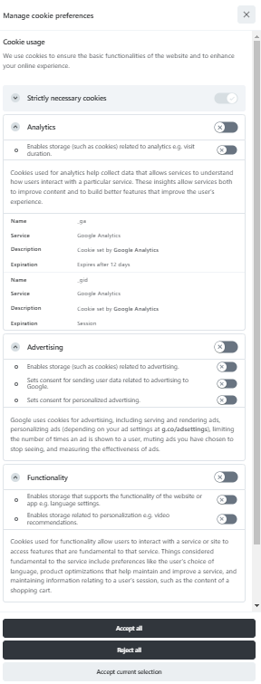

# Google consent mode
The script in this guide shows an example implementation to support Google Tag Manager's consent mode.

Descriptions and labels mainly taken from google documentations:
- https://support.google.com/tagmanager/answer/10718549?hl=en
- https://business.safety.google/adscookies/

Example result:



Include a script module as described in the [getting-started guide](../essential/getting-started.md).

```javascript
// cookieconsent-config.js

import * as CookieConsent from 'https://cdn.jsdelivr.net/gh/orestbida/cookieconsent@3.0.1/dist/cookieconsent.esm.js';

const CAT_NECESSARY = "necessary";
const CAT_ANALYTICS = "analytics";
const CAT_ADVERTISEMENT = "advertisement";
const CAT_FUNCTIONALITY = "functionality";
const CAT_SECURITY = "security";

const SERVICE_AD_STORAGE = 'ad_storage'
const SERVICE_AD_USER_DATA = 'ad_user_data'
const SERVICE_AD_PERSONALIZATION = 'ad_personalization'
const SERVICE_ANALYTICS_STORAGE = 'analytics_storage'
const SERVICE_FUNCTIONALITY_STORAGE = 'functionality_storage'
const SERVICE_PERSONALIZATION_STORAGE = 'personalization_storage'
const SERVICE_SECURITY_STORAGE = 'security_storage'

// Define dataLayer and the gtag function.
window.dataLayer = window.dataLayer || [];
function gtag(){dataLayer.push(arguments);}

// Set default consent to 'denied' (this should happen before changing any other dataLayer)
gtag('consent', 'default', {
    [SERVICE_AD_STORAGE]: 'denied',
    [SERVICE_AD_USER_DATA]: 'denied',
    [SERVICE_AD_PERSONALIZATION]: 'denied',
    [SERVICE_ANALYTICS_STORAGE]: 'denied',
    [SERVICE_FUNCTIONALITY_STORAGE]: 'denied',
    [SERVICE_PERSONALIZATION_STORAGE]: 'denied',
    [SERVICE_SECURITY_STORAGE]: 'denied',
});

/** 
 * Update gtag consent according to the users choices made in CookieConsent UI
 */
function updateGtagConsent() {
    gtag('consent', 'update', {
        [SERVICE_ANALYTICS_STORAGE]: CookieConsent.acceptedService(SERVICE_ANALYTICS_STORAGE, CAT_ANALYTICS) ? 'granted' : 'denied',
        [SERVICE_AD_STORAGE]: CookieConsent.acceptedService(SERVICE_AD_STORAGE, CAT_ADVERTISEMENT) ? 'granted' : 'denied',
        [SERVICE_AD_USER_DATA]: CookieConsent.acceptedService(SERVICE_AD_USER_DATA, CAT_ADVERTISEMENT) ? 'granted' : 'denied',
        [SERVICE_AD_PERSONALIZATION]: CookieConsent.acceptedService(SERVICE_AD_PERSONALIZATION, CAT_ADVERTISEMENT) ? 'granted' : 'denied',
        [SERVICE_FUNCTIONALITY_STORAGE]: CookieConsent.acceptedService(SERVICE_FUNCTIONALITY_STORAGE, CAT_FUNCTIONALITY) ? 'granted' : 'denied',
        [SERVICE_PERSONALIZATION_STORAGE]: CookieConsent.acceptedService(SERVICE_PERSONALIZATION_STORAGE, CAT_FUNCTIONALITY) ? 'granted' : 'denied',
        [SERVICE_SECURITY_STORAGE]: CookieConsent.acceptedService(SERVICE_SECURITY_STORAGE, CAT_SECURITY) ? 'granted' : 'denied',
    });
}

CookieConsent.run({
    // See: https://cookieconsent.orestbida.com/reference/configuration-reference.html#guioptions
    // ...
    
    // Trigger consent update when user choices change
    onFirstConsent: () => {
        updateGtagConsent();
    },
    onConsent: () => {
        updateGtagConsent();
    },
    onChange: () => {
        updateGtagConsent();
    },

    // Configure categories and services
    categories: {
        [CAT_NECESSARY]: {
            enabled: true,  // this category is enabled by default
            readOnly: true,  // this category cannot be disabled
        },
        [CAT_ANALYTICS]: {
            autoClear: {
                cookies: [
                    {
                        name: /^_ga/,   // regex: match all cookies starting with '_ga'
                    },
                    {
                        name: '_gid',   // string: exact cookie name
                    }
                ]
            },
            // See: https://cookieconsent.orestbida.com/reference/configuration-reference.html#category-services
            services: {
                [SERVICE_ANALYTICS_STORAGE]: {
                    label: 'Enables storage (such as cookies) related to analytics e.g. visit duration.',
                }
            }
        },
        [CAT_ADVERTISEMENT]: {
            services: {
                [SERVICE_AD_STORAGE]: {
                    label: 'Enables storage (such as cookies) related to advertising.',
                },
                [SERVICE_AD_USER_DATA]: {
                    label: 'Sets consent for sending user data related to advertising to Google.',
                },
                [SERVICE_AD_PERSONALIZATION]: {
                    label: 'Sets consent for personalized advertising.',
                },
            }
        },
        [CAT_FUNCTIONALITY]: {
            services: {
                [SERVICE_FUNCTIONALITY_STORAGE]: {
                    label: 'Enables storage that supports the functionality of the website or app e.g. language settings.',
                },
                [SERVICE_PERSONALIZATION_STORAGE]: {
                    label: 'Enables storage related to personalization e.g. video recommendations.',
                },
            }
        },
        [CAT_SECURITY]: {
            services: {
                [SERVICE_SECURITY_STORAGE]: {
                    label: 'Enables storage related to security such as authentication functionality, fraud prevention, and other user protection.',
                },
            }
        }
    },

    language: {
        default: 'en',
        translations: {
            en: {
                // See: https://support.google.com/tagmanager/answer/10718549?hl=en
                consentModal: {
                    title: 'We use cookies',
                    description: 'This website uses essential cookies to ensure its proper operation and tracking cookies to understand how you interact with it. The latter will be set only after consent.',
                    acceptAllBtn: 'Accept all',
                    acceptNecessaryBtn: 'Reject all',
                    showPreferencesBtn: 'Manage Individual preferences'
                },
                preferencesModal: {
                    title: 'Manage cookie preferences',
                    acceptAllBtn: 'Accept all',
                    acceptNecessaryBtn: 'Reject all',
                    savePreferencesBtn: 'Accept current selection',
                    closeIconLabel: 'Close modal',
                    sections: [
                        {
                            title: "Cookie usage",
                            description: "We use cookies to ensure the basic functionalities of the website and to enhance your online experience."
                        },
                        {
                            title: "Strictly necessary cookies",
                            description: "These cookies are essential for the proper functioning of the website, for example for user authentication.",
                            linkedCategory: CAT_NECESSARY,
                        },
                        {
                            title: "Analytics",
                            description: 'Cookies used for analytics help collect data that allows services to understand how users interact with a particular service. These insights allow services both to improve content and to build better features that improve the user’s experience.',
                            linkedCategory: CAT_ANALYTICS,
                            cookieTable: {
                                headers: {
                                    name: "Name",
                                    domain: "Service",
                                    description: "Description",
                                    expiration: "Expiration"
                                },
                                body: [
                                    {
                                        name: "_ga",
                                        domain: "Google Analytics",
                                        description: "Cookie set by <a href=\"https://business.safety.google/adscookies/\">Google Analytics</a>",
                                        expiration: "Expires after 12 days"
                                    },
                                    {
                                        name: "_gid",
                                        domain: "Google Analytics",
                                        description: "Cookie set by <a href=\"https://business.safety.google/adscookies/\">Google Analytics</a>",
                                        expiration: "Session"
                                    }
                                ]
                            }
                        },
                        {
                            title: 'Advertising',
                            description: 'Google uses cookies for advertising, including serving and rendering ads, personalizing ads (depending on your ad settings at <a href=\"https://g.co/adsettings\">g.co/adsettings</a>), limiting the number of times an ad is shown to a user, muting ads you have chosen to stop seeing, and measuring the effectiveness of ads.',
                            linkedCategory: CAT_ADVERTISEMENT,
                        },
                        {
                            title: 'Functionality',
                            description: 'Cookies used for functionality allow users to interact with a service or site to access features that are fundamental to that service. Things considered fundamental to the service include preferences like the user’s choice of language, product optimizations that help maintain and improve a service, and maintaining information relating to a user’s session, such as the content of a shopping cart.',
                            linkedCategory: CAT_FUNCTIONALITY,
                        },
                        {
                            title: 'Security',
                            description: 'Cookies used for security authenticate users, prevent fraud, and protect users as they interact with a service.',
                            linkedCategory: CAT_SECURITY,
                        },
                        {
                            title: 'More information',
                            description: 'For any queries in relation to the policy on cookies and your choices, please <a href="https://www.example.com/contacts">contact us</a>.'
                        }
                    ]
                }
            }
        }
    }
});
```